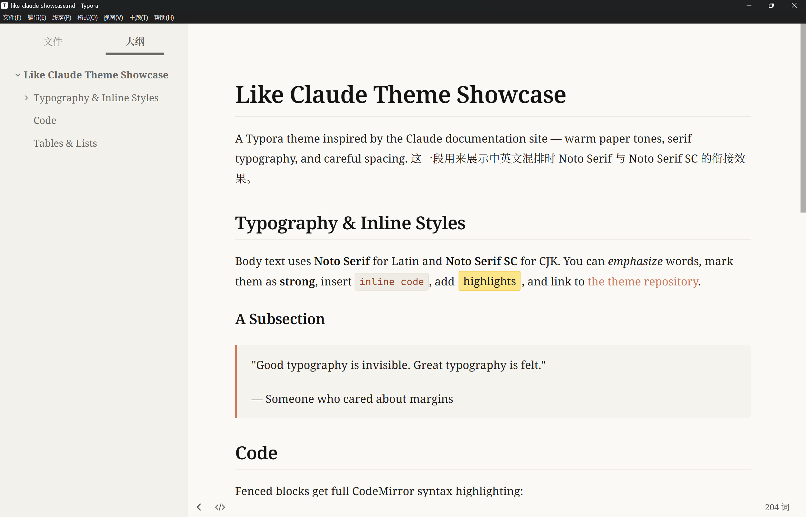
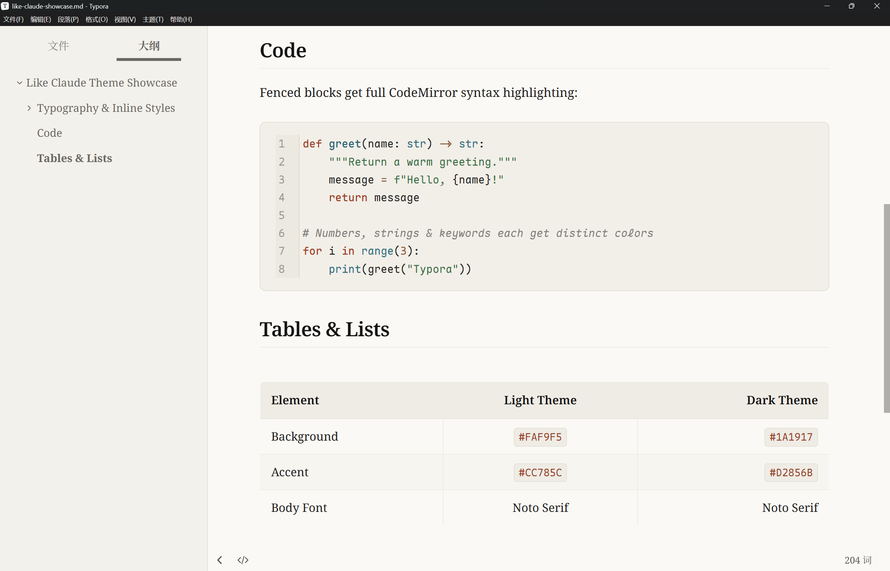
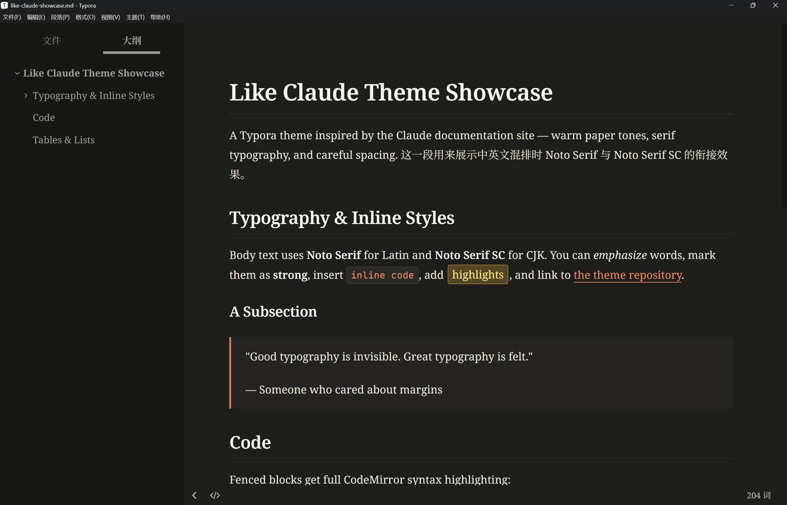
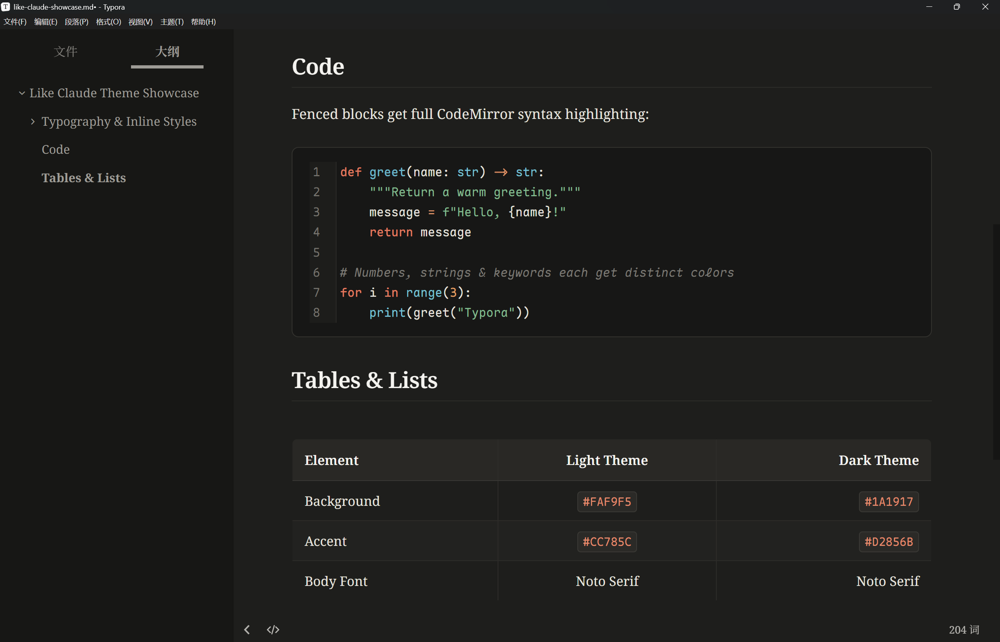

# Like Claude — Typora Theme

A pair of Typora themes (light + dark) inspired by the Claude documentation site's warm, paper-like aesthetic.

- **Serif-first typography**: Noto Serif / Noto Serif SC for body text, Maple Mono NF CN (with JetBrains Mono fallback) for code
- **Full UI styling**: sidebar, outline, and file tree included — not just the writing area
- **Complete CodeMirror syntax highlighting** mapping for fenced code blocks
- Warm accent color (`#CC785C`) with careful attention to quotes, tables, and highlights

## Themes

| File | Theme name in Typora |
|------|---------------------|
| `like-claude-light.css` | Like Claude Light |
| `like-claude-dark.css` | Like Claude Dark |

## Screenshots

**Like Claude Light**

**Like Claude Dark**

## Try It

Open [`like-claude-showcase.md`](like-claude-showcase.md) in Typora after installing — it exercises headings, inline styles, quotes, code blocks, tables, and lists in one page.

## Install

1. Download `like-claude-light.css` and `like-claude-dark.css` (or clone this repo).
2. In Typora: **File → Preferences → Appearance → Open Theme Folder**.
3. Copy the CSS files into that folder.
4. Restart Typora, then select **Like Claude Light** or **Like Claude Dark** from the **Themes** menu.

> Recommended fonts: [Noto Serif SC](https://fonts.google.com/noto/specimen/Noto+Serif+SC) (loaded automatically via web font) and [Maple Mono NF CN](https://github.com/subframe7536/maple-font) (install locally for best code rendering; falls back to JetBrains Mono).

## Compatibility

Designed and tested on Windows. Should work on macOS/Linux but not fully tested there. Does not include styles for Windows "unibody" style.

## License

[MIT](LICENSE)
